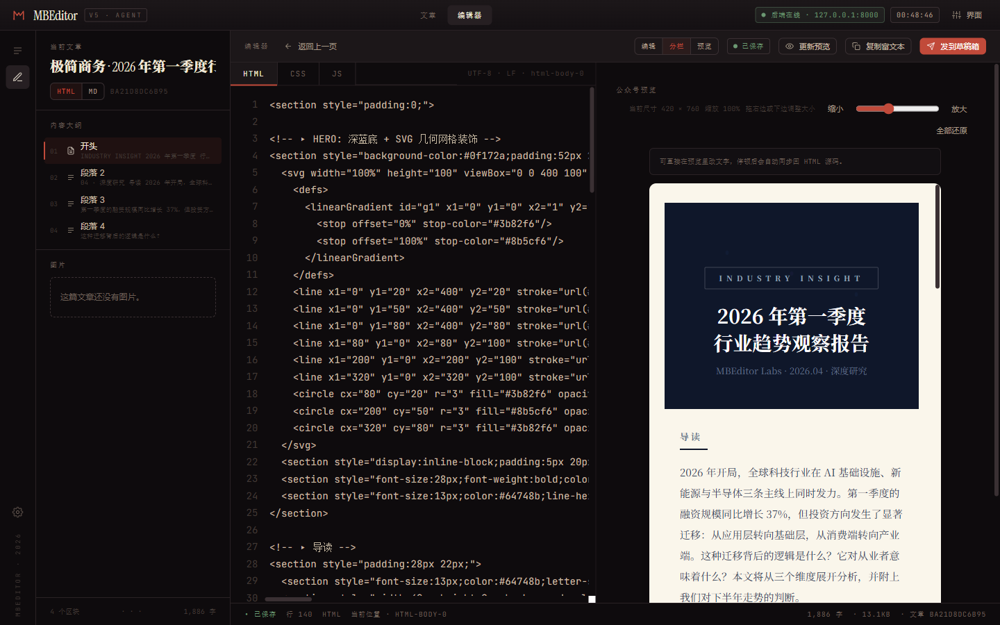
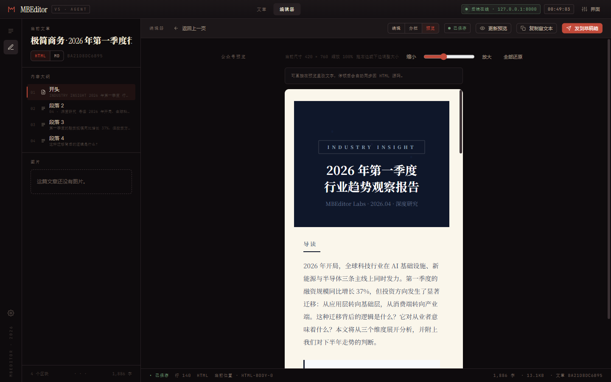
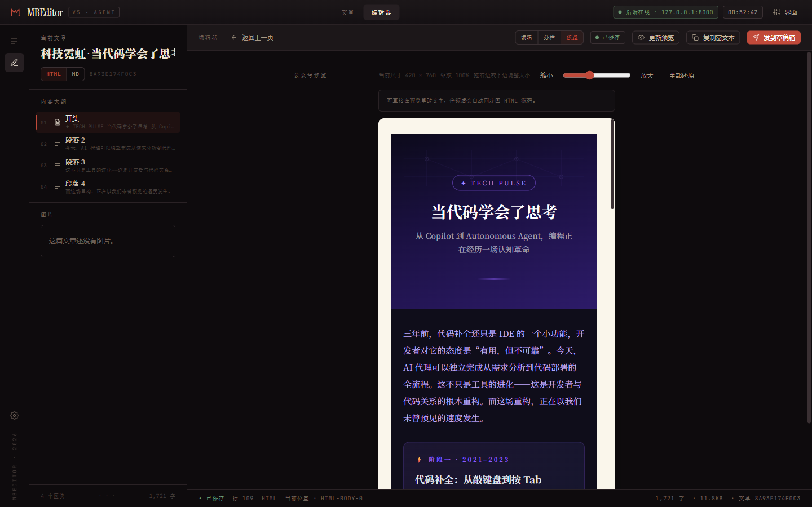
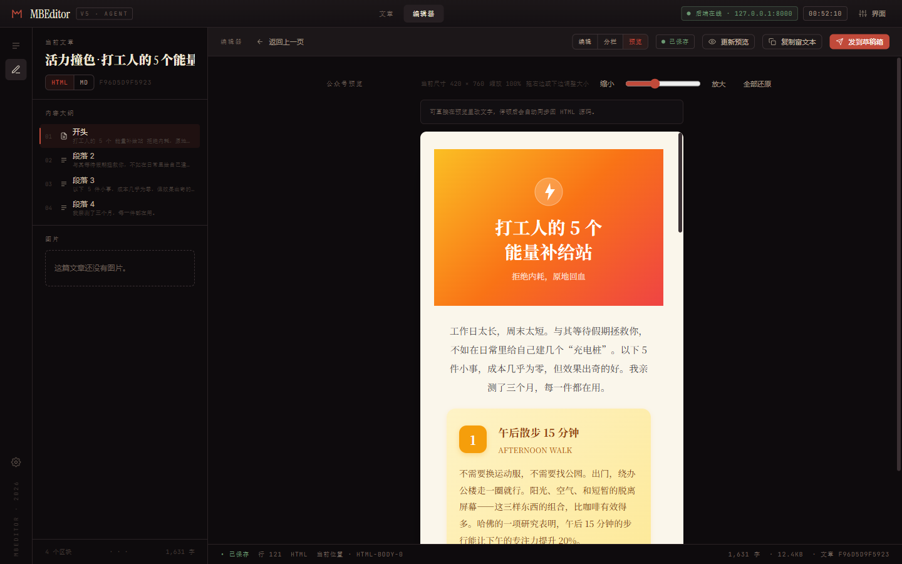
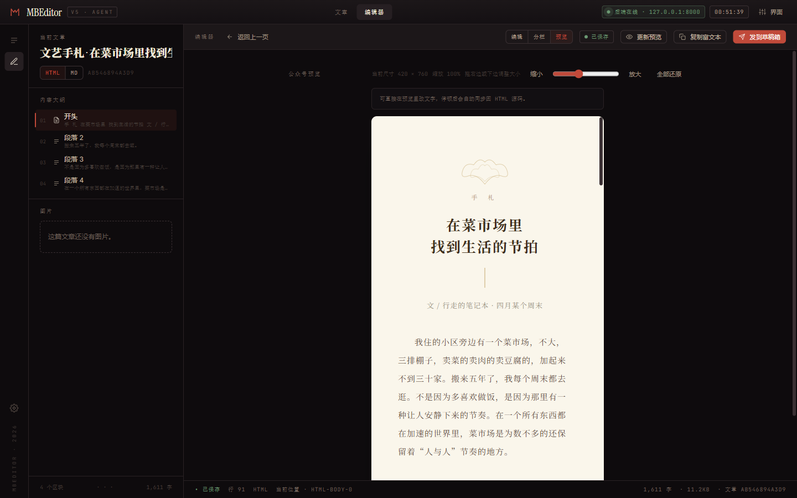
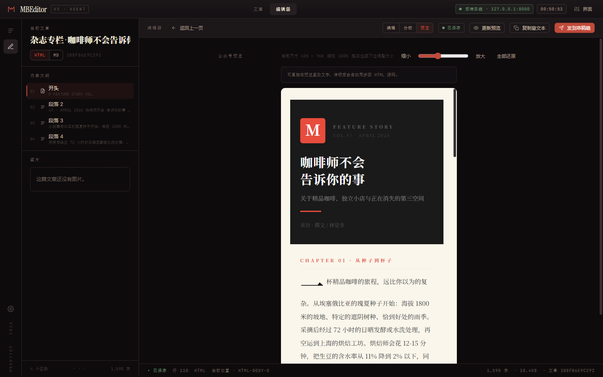

<div align="center">

# MBEditor

### AI CLI原生的微信公众号编辑器

**动动嘴，排版就好了。**

[](https://mbeditor.mbluostudio.com)
[](LICENSE)
[](docker-compose.yml)
[](skill/mbeditor.skill.md)
[](https://github.com/AAAAAnson/mbeditor/releases/tag/v5.0.0)

</div>

---



## 为什么做了这个

市面上的公众号编辑器都是给人用的。

但当 AI 助手成为内容生产的主力，编辑器需要的不是更好看的 UI，而是 **能被程序调用的接口**。MBEditor 的每个功能都是一个 API 端点——创建文章、套用模板、上传图片、一键推送草稿箱——全部 `curl` 一行搞定。

你可以用 Claude Code 说一句「写一篇 Docker 入门推文，杂志风排版，发到草稿箱」，剩下的事情 Agent 自己完成。

## 四个核心差异

<table>
<tr>
<td width="25%">

**CLI原生**

不是"兼容 AI"，是"为 AI 设计"。完整 RESTful API + Typer CLI，Skill 文件即装即用。Claude Code / Codex / OpenClaw 任意一个 Agent 都能直接操控编辑器。

</td>
<td width="25%">

**所见即所得**

预览画布本身就是编辑器。直接在公众号样式下改文字，500ms 自动回写 HTML/Markdown 源码；结构保持一致时不会重排元素。

</td>
<td width="25%">

**命令行全流程**

从创建、套模板、改文案到推草稿箱，不用打开浏览器也能跑完。适合 CI/CD 流水线、定时任务、批量生产。

</td>
<td width="25%">

**V5 开箱 5 套模板**

极简商务 / 科技霓虹 / 活力撞色 / 文艺手札 / 杂志专栏，全部纯 inline `<section>` + SVG 装饰，100% 过微信 sanitizer 白名单。

</td>
</tr>
</table>

## 五套示例模板

部署完第一次打开就能看到，直接在编辑器内套用；也可以通过 CLI / API 一键导入。

<table>
<tr>
<td align="center" width="20%"><strong>极简商务</strong><br/>行业报告 / 企业通告</td>
<td align="center" width="20%"><strong>科技霓虹</strong><br/>产品发布 / 科技资讯</td>
<td align="center" width="20%"><strong>活力撞色</strong><br/>生活清单 / 品牌活动</td>
<td align="center" width="20%"><strong>文艺手札</strong><br/>散文 / 读书笔记</td>
<td align="center" width="20%"><strong>杂志专栏</strong><br/>深度报道 / 人物专访</td>
</tr>
<tr>
<td></td>
<td></td>
<td></td>
<td></td>
<td></td>
</tr>
</table>

> 模板源文件在 `docs/cli/examples/templates/tpl_*.json`，每篇 ≥ 1500 字，内容全是具体事实或研究数据，可以直接拿来练手 / 做对标。

## 快速开始

### 第一步：部署 MBEditor

```bash
git clone https://github.com/AAAAAnson/mbeditor.git
cd mbeditor
docker compose up -d
```

部署完成后：
- **编辑器界面**：http://localhost:7073
- **API 接口**：http://localhost:7072/api/v1

**已部署过的用户升级到 V5：**

```bash
cd mbeditor
git pull
docker compose up --build -d
```

> 升级不会丢失数据，文章和图片存储在 `data/` 目录中，不受容器重建影响。

### 第二步：安装技能

MBEditor 提供了 `skill/mbeditor.skill.md`，安装后AI Agent就能直接操控编辑器。

<details open>
<summary><strong>Claude Code</strong></summary>

**方式一：项目级安装（推荐）**

在 MBEditor 项目目录下直接使用，Agent 会自动发现 `skill/mbeditor.skill.md`：

```bash
cd mbeditor
claude "帮我写一篇关于 Docker 的推文，推到草稿箱"
```

**方式二：全局安装（任意目录可用）**

```bash
# macOS / Linux
mkdir -p ~/.claude/skills
cp skill/mbeditor.skill.md ~/.claude/skills/mbeditor.skill.md

# Windows
mkdir %USERPROFILE%\.claude\skills
copy skill\mbeditor.skill.md %USERPROFILE%\.claude\skills\mbeditor.skill.md
```

安装后在任意目录都可以使用：

```bash
claude "写一篇 AI 入门的公众号文章，杂志风排版，发到草稿箱"
```

</details>

<details>
<summary><strong>Codex</strong></summary>

```bash
mkdir -p ~/.codex/agents
cp skill/mbeditor.skill.md ~/.codex/agents/mbeditor.skill.md

codex "部署微信编辑器，然后写一篇推文发到草稿箱"
```

</details>

<details>
<summary><strong>OpenClaw</strong></summary>

```bash
openclaw skill add ./skill/mbeditor.skill.md

openclaw "写一篇公众号推文，主题是 Docker 入门"
```

</details>

> **默认端口**：Docker 部署下 API 在 `7072`，编辑器在 `7073`。本地开发请把 Skill 内端口改成对应值，或在 `docker-compose.yml` 里改映射。

### 第三步：配置微信公众号（可选）

如果需要一键推送到公众号草稿箱，在编辑器的「设置」页面填入微信公众号的 AppID / AppSecret，或通过 API 配置：

```bash
curl -X PUT http://localhost:7072/api/v1/config \
  -H "Content-Type: application/json" \
  -d '{"appid":"wx你的appid","appsecret":"你的appsecret"}'
```

`data/config.json` 默认走示例值，且被 `.gitignore` 覆盖——凭证永远不会进 git。

## Agent工作流

MBEditor 的设计哲学是 **Agent优先**。Agent 通过 REST API 完成全部操作：

```bash
# 1. 套用"极简商务"模板创建文章
TEMPLATE=docs/cli/examples/templates/tpl_biz_minimal.json
ID=$(curl -s -X POST http://localhost:7072/api/v1/articles \
     -H 'Content-Type: application/json' \
     -d "$(python -c "import json;d=json.load(open('$TEMPLATE',encoding='utf-8'));print(json.dumps({'title':d['title'],'mode':d['mode']}))")" \
     | python -c "import json,sys;print(json.load(sys.stdin)['data']['id'])")

curl -s -X PUT "http://localhost:7072/api/v1/articles/$ID" \
  -H 'Content-Type: application/json' -d @"$TEMPLATE"

# 2. 上传封面
curl -X POST http://localhost:7072/api/v1/images/upload -F "file=@cover.png"

# 3. 一键推送到微信草稿箱
curl -X POST http://localhost:7072/api/v1/publish/draft \
  -H 'Content-Type: application/json' -d "{\"article_id\":\"$ID\"}"
```

或者一句话搞定：

```bash
claude "套用极简商务模板写一篇 Q2 行业观察，推到草稿箱"
```

## 编辑器功能


### 三种编辑方式

| 模式 | 适合谁 | 能做什么 |
|------|--------|---------|
| **HTML 模式** | 设计师 / Agent | HTML + CSS + JS 三栏编辑，像素级控制每一个元素 |
| **Markdown 模式** | 写作者 | 用最简洁的语法写作，`mode=markdown` 时服务端会自动编译成 HTML 同步给预览 |
| **所见即所得** | 所有人 | 直接在预览里改文字，500ms 后自动回写 Markdown/HTML 源码 |

### 编辑器特性

- **可拖拽预览框**：右边 / 下边 / 右下角三种 resize 把手，独立缩放滑杆 40%–200%，尺寸和缩放分别持久化。
- **结构面板**：左侧自动列出 H1/H2/H3 大纲和图片大纲，点击即跳，预览和编辑器同步高亮。
- **未保存保护**：关闭自动保存时草稿不会丢，文章切换也不会清空。
- **返回栈**：编辑器顶栏保留「返回上一页 / 返回稿库」，不会把你困在某一篇里。

### 发布能力

- 一键复制富文本到剪贴板，预览效果 = 粘贴效果。
- 一键推送到微信公众号草稿箱，自动上传图片到微信 CDN。
- CSS 自动内联化 + 基础排版样式注入，`<section>` / SVG / 内联 `style` 全保留。
- Publish pipeline 已覆盖 600+ 行复杂 HTML，草稿高度还原度 ≈ 0.37%，陷阱见 `CHANGELOG.md`。

## 推荐搭配技能

MBEditor 负责编辑和发布，排版设计和内容风格可以搭配以下技能使用：

| 技能 | 用途 | 链接 |
|-------|------|------|
| **Anthropic Frontend Design** | 排版设计风格 — 生成高质量、有设计感的 HTML 排版，告别 AI 味 | [anthropics/skills/frontend-design](https://github.com/anthropics/skills/tree/main/skills/frontend-design) |
| **Khazix Skills** | 内容写作风格 — 公众号长文写作、个人风格化内容输出 | [KKKKhazix/khazix-skills](https://github.com/KKKKhazix/khazix-skills) |

```bash
claude install-skill https://github.com/anthropics/skills/tree/main/skills/frontend-design
claude install-skill https://github.com/KKKKhazix/khazix-skills
```

> 搭配使用：Khazix 负责内容、Frontend Design 负责排版、MBEditor 负责预览和发布。三者配合可以实现从写作到草稿箱的全链路自动化。

## 技术栈

| 前端 | 后端 | 部署 |
|------|------|------|
| React 19 + TypeScript | FastAPI + Python 3.11 | Docker Compose |
| Tailwind CSS 4 + Zustand | premailer（CSS 内联化） | Nginx 反代 |
| 可编辑预览 + Monaco | Pillow（图片处理） | `docker compose up -d` 一键启 |
| walnut / paper / swiss 三主题 | 微信公众号 API | 端口 7073 / 7072 |

## API 参考

<details>
<summary><strong>完整 API 端点列表</strong></summary>

### 文章

| 方法 | 端点 | 说明 |
|------|------|------|
| `POST` | `/api/v1/articles` | 创建文章 `{title, mode}` |
| `GET` | `/api/v1/articles` | 列出所有文章 |
| `GET` | `/api/v1/articles/{id}` | 获取文章详情 |
| `PUT` | `/api/v1/articles/{id}` | 更新文章 `{html, css, js, markdown, title, mode}`。`mode=markdown` 时仅提交 Markdown 会自动编译 HTML |
| `DELETE` | `/api/v1/articles/{id}` | 删除文章 |

### 图片

| 方法 | 端点 | 说明 |
|------|------|------|
| `POST` | `/api/v1/images/upload` | 上传图片（自动 MD5 去重） |
| `GET` | `/api/v1/images` | 列出所有图片 |
| `DELETE` | `/api/v1/images/{id}` | 删除图片 |

### 发布

| 方法 | 端点 | 说明 |
|------|------|------|
| `POST` | `/api/v1/publish/draft` | 推送到微信草稿箱 |
| `POST` | `/api/v1/publish/preview` | 预览处理（CSS 内联化） |
| `POST` | `/api/v1/publish/process` | 处理文章图片（上传到微信 CDN） |
| `GET` | `/api/v1/publish/html/{id}` | 获取处理后的 HTML |

### 配置 / 版本

| 方法 | 端点 | 说明 |
|------|------|------|
| `GET` | `/api/v1/config` | 查看配置状态 |
| `PUT` | `/api/v1/config` | 设置微信 AppID / AppSecret |
| `GET` | `/api/v1/version` | 当前版本 `{version, repo}` |

</details>

## 项目结构

```
mbeditor/
├── frontend/               # React 19 + TypeScript + Tailwind 4
│   └── src/
│       ├── surfaces/       # editor / articles / settings / agent-console
│       ├── components/     # UI 原子组件 + icons + BrandLogo
│       └── stores/         # uiStore / articlesStore（Zustand）
├── backend/                # FastAPI + Python
│   └── app/
│       ├── api/v1/         # REST API 路由
│       ├── cli/            # Typer CLI（info / articles / publish）
│       └── services/       # 文章 / 图片 / 微信 API / renderers
├── skill/                  # AI Agent Skill 定义
│   └── mbeditor.skill.md   # Claude Code / Codex / OpenClaw 兼容
├── docs/
│   ├── cli/examples/templates/  # 五套示例模板 tpl_*.json
│   └── screenshots/        # README 截图
├── docker-compose.yml      # 一键部署
└── LICENSE                 # MIT
```

## 本地开发

```bash
# 后端
cd backend
uv sync            # 或 pip install -e .
uvicorn app.main:app --reload --port 7072

# 前端（新终端）
cd frontend && npm install && npm run dev
```

运行时 MBEditor 会自动识别仓库布局：如果检测到 `docker-compose.yml`，数据目录走仓库根 `data/`；否则落 `backend/data/`。

## 贡献

欢迎提交 [Issue](https://github.com/AAAAAnson/mbeditor/issues) 和 [Pull Request](https://github.com/AAAAAnson/mbeditor/pulls)。

<a href="https://github.com/AAAAAnson">
  
</a>

**[AAAAAnson](https://github.com/AAAAAnson)** — 创建者与维护者

## 许可证

[MIT](LICENSE) &copy; 2025 Anson

_专注内容，其他交给 MBEditor。_
